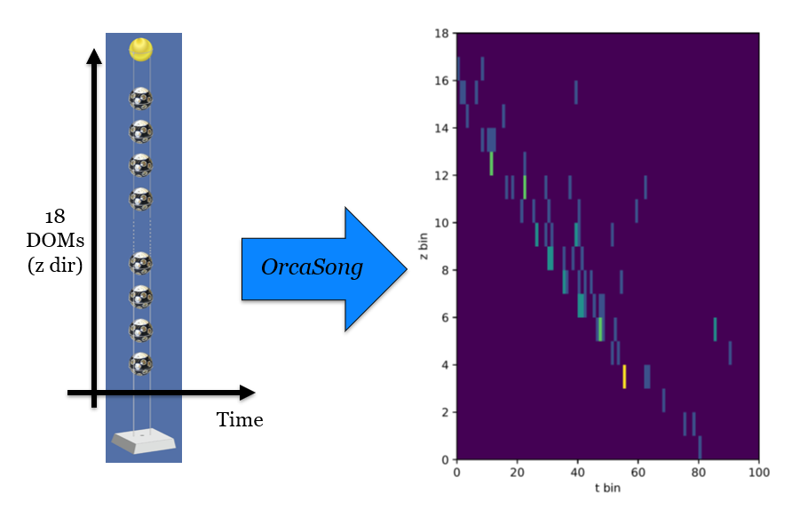

.. _orcasong_page:

Producing DL files from h5
==========================

Describes how to use OrcaSong to produce files for Deep Learning
from h5 files. These files can contain either images (for convolutional
networks), or graphs (for Graph networks).

.. contents:: :local:

Mode 1: Producing images
------------------------

Generate multidimensional images out of km3net data.

Basic Use
^^^^^^^^^

Import the main class, the FileBinner (see
:py:class:`orcasong.core.FileBinner`),
like this:

.. code-block:: python

    from orcasong.core import FileBinner

The FileBinner allows to make nd histograms ("images") from h5-converted root files.
To do this, you can pass a list defining the binning. E.g., the following would
set up the file binner to generate zt data:

.. code-block:: python

    bin_edges_list = [
        ["pos_z", np.linspace(0, 200, 11)],
        ["time", np.linspace(-50, 550, 101)],
    ]

    fb = FileBinner(bin_edges_list)

Calling the object like this will show you the binning:

.. code-block:: python

    >>> fb
    <FileBinner: ('pos_z', 'time') (10, 100)>

As you can see, the FileBinner will produce zt data, with 10 and 100 bins,
respectively.
Convert a file like this:

.. code-block:: python

    fb.run(infile, outfile)

Or convert multiple files, which will all be saved in the given folder:

.. code-block:: python

    fb.run_multi(infiles, outfolder)

Plotting binning statistics
^^^^^^^^^^^^^^^^^^^^^^^^^^^

After the binning has succeeded, you can generate a plot which shows the
distribution of hits among the bins you defined. For this, call the following
console command::

    plot_binstats file_1_binned.h5 file_2_binned.h5 ... --save_as my_plotname.pdf

This will plot the statistics for the files file_1_binned.h5, file_2_binned.h5, ...
into the file my_plotname.pdf.

Using existing binnings
^^^^^^^^^^^^^^^^^^^^^^^

You can use existing bin edges and mc info extractors from ``orcasong.bin_edges``
and ``orcasong.mc_info_extr``. These were designed for specific detector layouts
and productions, and might not work properly when used on other data.

Mode 2: Producing Graphs
------------------------

Generate the nodes of graphs from km3net data.

Basic Use
^^^^^^^^^

Import the main class, the FileGraph (see
:py:class:`orcasong.core.FileGraph`),
like this:

.. code-block:: python

    from orcasong.core import FileGraph

The FileGraph produces a list of nodes, each representing a hit.
The length of this list has to be fixed, i.e. be the same for each event.
Since the number of hits varies from event to event, some events will have to get
padded, while others might get hits removed. The parameter ``max_n_hits``
of FileGraph determines this fixed length:

.. code-block:: python

    fg = FileGraph(max_n_hits=2000)

General usage
-------------

Functionality that both modes have in common.

Calibration
^^^^^^^^^^^

You can supply a detx file to the file binner, in order to
calibrate the data on the fly:

.. code-block:: python

    fb = FileBinner(bin_edges_list, det_file="path/to/det_file.detx")

Adding mc_info
^^^^^^^^^^^^^^

Define a function ``my_extractor``, which takes as an input a km3pipe blob,
and outputs a dict mapping str to float.
It should contain everything you need later down the pipeline, e.g. labels,
event identifiers, ...

This will be saved as a numpy structured array "y" in the output file, with
the str being the dtype names. Set up like follows:

.. code-block:: python

    fb = FileBinner(bin_edges_list, extractor=my_extractor)

